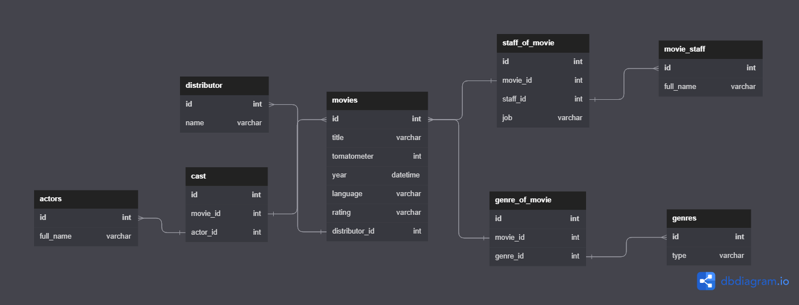

# **DATA MINING PROJECT** *ITC OCT 2022*
***

## Members
-----------------
Ethan BEN ATTAR 

Meïr AMAR

## Introduction
-----------------
For this project, we decide to scrap all the movies avaible on streaming platforms rated on the website https://www.rottentomatoes.com/browse/movies_at_home/

## Milestone 1
-----------------
We created a webscraper using the packages **REQUESTS**, **BEAUTIFOULSOUP** and **SELENIUM**.

**REQUESTS** was used to validate that the datas are avaible.
**BEAUTIFOULSOUP** was used to register the HTML datas and to find the informations needed.
**SELENIUM** was used to navigate into the main page.

For each movie, we explored the related link to take a maximum of informations (date, type, rate...)

The main challenge we faced is on the main page. Rotten Tomatoes provides a big amount of movies. That means a big amount of pages.
The pages are scrolled behind each others, and to open a new one, it is required to 'click' on a `LOAD MORE` button.
When **REQUESTS** tries to get the url of pages superior to 6, the website loops back to page 5. That means, we can't extract the list of the films on next pages, even if we tried to get it before.
To solve this challenge, we used **SELENIUM** and a nice team spirit to improve the code.
We first add lines to click on the button until the button deseappears.
The "REQUESTS" updates the page, so all the HTML code was lost. Then, we added lines to extract the HTML code before this update.

## Milestone 2
-----------------
We created a webscraper using the packages **REQUESTS**, **BEAUTIFOULSOUP** and **SELENIUM**.

We also created an ERD to structure our database.

# Instruction
-----------------
To use the scrapper, first open a command line terminal. Once this is done go in the folder containing the project.
Then, to execute it, tap ```$ py ./scrapper_rt.py [NUMBER_OF_PAGES]``` as a command line, with [NUMBER_OF_PAGES] being replaced by the number of pages to scrappe.

# ERD
-----------------

